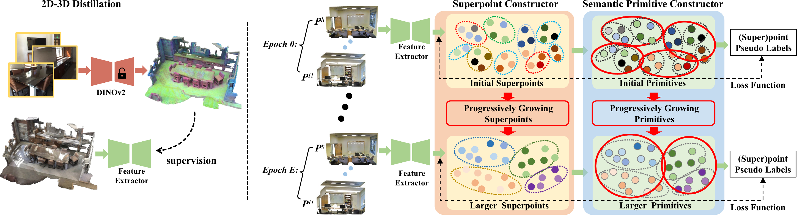

[](https://ieeexplore.ieee.org/document/11322855)

[](https://twitter.com/vLAR_Group)
[](./LICENSE)

## GrowSP++: Growing Superpoints and Primitives for Unsupervised 3D Semantic Segmentation (TPAMI 2026)
[Zihui Zhang](https://zihui0930.github.io/), 
[Weisheng Dai](https://scholar.google.com/citations?user=O6Tr52jUS9cC&hl=zh-CN), 
[Bing Wang](https://bingcs.github.io/), [Bo Yang](https://yang7879.github.io/),
[Bo Li](https://www4.comp.polyu.edu.hk/~bo2li/)

### Overview

We propose an unsupervised learning approach for 3D semantic segmentation.

<p align="center">  </p>

## 1. Environment

```shell script
### CUDA 12.6
conda create -n GrowSP_ext python=3.10
conda activate GrowSP_ext
##
pip install torch==2.6.0 torchvision==0.21.0 torchaudio==2.6.0 --index-url https://download.pytorch.org/whl/cu126
pip install spconv-cu126
pip install torch-scatter -f https://pytorch-geometric.com/whl/torch-2.6.0+cu126.html
```
*Note that the superpoints construction relies on **pclpy Library** (used in superpoint construction of ScanNet and S3DIS) 
must be installed with **Python<=3.8**, so it needs an extra python environment `SP`.
```shell script
conda env create -f sp_env.yml
```

## 2. Data Preparation
### ScanNet
Download data from [here](http://kaldir.vc.in.tum.de/scannet_benchmark/documentation), and uncompress to  `./data/ScanNet/raw/`
for preprocessing:
```shell script
cd data_prepare
python data_prepare_ScanNet.py --data_path '../data/ScanNet/raw/' --save_path '../data/ScanNet/processed/'
``` 
For superpoints, we can follow [GrowSP](https://github.com/vLAR-group/GrowSP) to use VCCS+Region Growing. 
Switching the environment into `SP` and run:
```shell script
python initialSP_prepare_ScanNet.py --data_path '../data/ScanNet/processed/' --save_path '../data/ScanNet/initial_superpoints/'
``` 


After superpoints construction and data preprocessing, we can extract and project DINOv2 features.
We resume the data provided by [OpenScene](https://github.com/pengsongyou/openscene), uncompress into `./data/ScanNet`.
```shell script
wget https://cvg-data.inf.ethz.ch/openscene/data/scannet_processed/scannet_3d.zip
wget https://cvg-data.inf.ethz.ch/openscene/data/scannet_processed/scannet_2d.zip
```
Finally, Switching the environment into `GrowSP_ext` and
extracting DINOv2 features and project to 3D point clouds by:
```shell script
cd ../distillation
CUDA_VISIBLE_DEVICES=0 python project_ScanNet.py
```
This will create 3D point clouds with features in `./data/ScanNet/dinov2s14`.
The data structure should be:
```shell script
ScanNet
└── processed
└── scannet_2d
└── scannet_3d
|   └── train
|   └── val
|   └── scannetv2_train.txt
|   └── scannetv2_val.txt
|   └── scannetv2_test.txt
└── initial_superpoints
└── dinov2s14
``` 

### S3DIS
S3DIS dataset can be found [here](https://docs.google.com/forms/d/e/1FAIpQLScDimvNMCGhy_rmBA2gHfDu3naktRm6A8BPwAWWDv-Uhm6Shw/viewform?c=0&w=1). 
Download the files named "Stanford3dDataset_v1.2.zip". Uncompress it to `data/S3DIS/raw`. 
Some bugs exists in S3DIS raw data, e.g.line323474 in Area_5/office_19/Annotations/ceiling_1.txt
Then run the commands below to begin preprocessing:
```shell script
cd data_prepare
python data_prepare_S3DIS.py --data_path '../data/S3DIS/raw/' --save_path '../data/S3DIS/unalign/'
``` 
Switching the environment into `SP` and run:
```shell script
python initialSP_prepare_S3DIS.py --data_path '../data/S3DIS/unalign/' --save_path '../data/S3DIS/initial_superpoints/'
```

The 2D image and camera parameters are storted in [2D-3D-S dataset](https://github.com/alexsax/2D-3D-Semantics), please 
download it and extract DINO features for S3DIS by:
```shell script
cd distillation
python project_S3DIS.py
```
This will create 3D point clouds with features in `./data/S3DIS/dinov2s14`.
The data structure should be:
```shell script
S3DIS
└── unalign
└── initial_superpoints
└── dinov2s14
└── 2D-3D-S
    └── Area1
    └── Area2
    ...
    └── Area5a
    └── Area5b
    └── Area6
```

### nuScenes
The training and validation set of nuScenes (including RGB for distillation) can be downloaded following OpenScene:
```shell script
# all 3d data
wget https://cvg-data.inf.ethz.ch/openscene/data/nuscenes_processed/nuscenes_3d.zip
wget https://cvg-data.inf.ethz.ch/openscene/data/nuscenes_processed/nuscenes_3d_train.zip
# all image data
wget https://cvg-data.inf.ethz.ch/openscene/data/nuscenes_processed/nuscenes_2d.zip
```

Constructing superpoints by:
```shell script
cd data_prepare
python initialSP_prepare_nuScenes.py --input_path '../data/nuScenes/nuScenes_3d/train/' --save_path '../data/nuScenes/initial_superpoints/'
```

DINOv2 features extracting and projecting by:
```shell script
cd ../distillation
CUDA_VISIBLE_DEVICES=0 python project_nuScenes.py --data_path '../data/nuScenes' --save_path '../data/nuScenes/dinov2s14'
```

The data structure should be:
```shell script
nuScenes
└── nuScenes_3d
|   └── train
|   └── val
└── nuScenes_2d
|   └── train
|   └── val
└── initial_superpoints
|   └── train
└── dinov2s14
```

## 3. Training
### ScanNet
The DINO features have been precompted, therefore the distillation model can be trained by:
```shell script
cd distillation
CUDA_VISIBLE_DEVICES=0 python train_distill_scannet.py --data_path '../data/ScanNet/processed' --feats_path '../data/ScanNet/dinov2s14' --save_path '../ckpt_distill/ScanNet' --splits '../data_prepare/ScanNet_splits/scannetv2_trainval.txt'
```
After distillation, we have the model checkpoints and train the segmentation model:
```shell script
# e.g., use the epoch 300 checkpoint
cd ..
CUDA_VISIBLE_DEVICES=0 python train_seg_scannet.py --data_path 'data/ScanNet/processed' --sp_path 'data/ScanNet/initial_superpoints' --save_path 'ckpt_seg/ScanNet' --distill_ckpt 'ckpt_distill/ScanNet/checkpoint_300.tar'
```

### S3DIS
Distillation model can be trained by:
```shell script
cd distillation
CUDA_VISIBLE_DEVICES=0 python train_distill_s3dis.py --data_path '../data/S3DIS/unalign' --feats_path '../data/S3DIS/dinov2s14' --save_path '../ckpt_distill/S3DIS'
```
After distillation, we have the model checkpoints and train the segmentation model:
```shell script
# e.g., use the epoch 300 checkpoint
cd ..
CUDA_VISIBLE_DEVICES=0 python train_seg_s3dis.py --data_path 'data/S3DIS/unalign' --sp_path 'data/S3DIS/initial_superpoints' --save_path 'ckpt_seg/S3DIS' --distill_ckpt 'ckpt_distill/S3DIS/checkpoint_300.tar'
```
### nuScenes
Distillation & Segmentation:
```shell script
cd ditillation
CUDA_VISIBLE_DEVICES=0 python train_distill_nuScenes.py --data_path '../data/nuScenes/nuScenes_3d/train/' --feats_path '../data/nuScenes/dinov2s14' --save_path '../ckpt_distill/nuScenes'
# e.g., use the epoch 300 checkpoint
cd ..
CUDA_VISIBLE_DEVICES=0 python train_seg_nuScenes.py --data_path './data/nuScenes/nuScenes_3d/train' --val_input_path './data/nuScenes/nuScenes_3d/val' --save_path 'ckpt_seg/nuScenes' --distill_ckpt 'ckpt_distill/nuScenes/checkpoint_300.tar' --sp_path './data/nuScenes/initial_superpoints/train'
```
If preparing the online testing predictions, please download testing data from [here](https://www.nuscenes.org/nuscenes#panoptic), 
Uncompress them and put the data structure as: 
```shell script
v1.0-test_meta
└── v1.0-test
└── samples
└── maps
└── LICENSE
```
Making preprocessing for testing data, and then running testing for [online submission]():
```shell script
# pip install nuscenes-devkit
python nuScenes_test_extraction.py --input_dir './v1.0-test_meta' --output_dir './data/nuScenes/nuScenes_3d/test'

# mode_ckpt, classifier_ckpt should be indicated. e.g. './ckpt_seg/nuScenes/model_50_checkpoint.pth' 
CUDA_VISIBLE_DEVICES=0 python nuScenes_test_preds.py --test_input_pat './nuScenes_test_data' --val_input_path './data/nuScenes/nuScenes_3d/val' --out_path './nuScenes_online_testing', --mode_ckpt './ckpt_seg/nuScenes/model_50_checkpoint.pth' --classifier_ckpt './ckpt_seg/nuScenes/cls_50_checkpoint.pth' 
```


## 4. Checkpoints
The well-trained checkpoints for three datasets are in [Google Drive](https://drive.google.com/file/d/1RWmYqECHDNyuULe79obLVw3uWS2xYOby/view?usp=sharing).
The code used for visualization are in `vis_predictions`.
